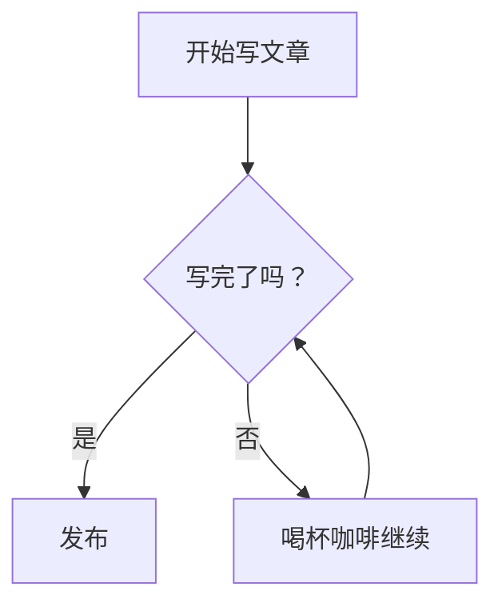

# ✍️ 从零开始的 Markdown 写作魔法课

> 让你优雅地告别“乱码排版”，成为文档颜值控

你有没有遇到过这样的场景：
写了一篇结构清晰、内容饱满的笔记，可一打开，满屏都是大小不一、颜色乱跳的文字，自己都不想再看第二眼。
别担心，这很可能不是你的问题，而是你还没学会 **Markdown** 这门“排版化妆术”。

今天这篇教程，我会带你从零开始，一步步掌握 Markdown 的核心用法。保证你看完后，不仅能写出干净漂亮的文档，还能在不经意间流露出一种“我是效率达人”的从容感。

------

## 一、Markdown 是个啥？为什么值得学？

简单说，Markdown 就是一种**用纯文本控制排版**的标记语言。
你只需要在文字里加一些小符号，它就能自动变成标题、列表、链接、图片等格式，完全不用鼠标去菜单栏里点点点。

📌 它的三大魅力：

1. **上手极快**：语法简单到像在聊天里发 emoji
2. **格式统一**：同一份文档，在任何工具里打开都一模一样
3. **随处可用**：GitHub、Notion、Obsidian、飞书、语雀……几乎所有笔记和协作平台都支持

如果你常写博客、技术文档、学习笔记，甚至只是想给朋友发一条清晰的长消息，Markdown 都是你的极佳拍档。

------

## 二、写出第一条漂亮文字：标题与段落

### 1. 标题：文章的骨架

在文字前面加 `#` 号，一个 `#` 是一级标题，两个 `##` 是二级，最多到六级。

    ```markdown
    # 我是大老板（一级标题）
    ## 我是部门经理（二级标题）
    ### 我是小组长（三级标题）
    ```

!!! tip "小贴士："
    `#` 后面记得加一个空格，养成好习惯。

### 2. 段落与换行

Markdown 里，直接换行并不会产生新段落，你需要**空一整行**才能分开。
如果想在同一段落内换行，在行尾打**两个空格**再回车。

```markdown
这是第一段。

这是第二段（因为中间空了一行）。
```

效果：两段之间会有明显的间距，阅读起来更透气

------

## 三、让文字变得有态度：强调与修饰

别让你的文字像个机器人，加点语气吧。

| 语法                         | 效果                     |
| :--------------------------- | :----------------------- |
| `**粗体**`                   | **我是粗体，重点都看我** |
| `*斜体*`                     | *我是斜体，语调微微上扬* |
| `~~删除线~~`                 | ~~这事儿已经翻篇了~~     |
| `==高亮==`（部分编辑器支持） | ==重点中的重点==         |

也可以组合使用：
`***又粗又斜***` → ***又粗又斜***

> 如果你用的是标准 Markdown，高亮语法可能不生效，但 Typora、Obsidian 等神器基本都支持，记得查看你工具的小本本。

------

## 四、组织信息的利器：列表与待办

### 1. 无序列表

用 `-`、`*` 或 `+` 都可以，个人偏爱 `-`，因为打起来最省力。

```markdown
- 买菜
- 写代码
- 摸一会儿鱼
```

效果：

- 买菜
- 写代码
- 摸一会儿鱼

### 2. 有序列表

数字加英文句点，而且神奇的是——**你不需要把数字顺对，Markdown 会自动帮你修正**。

```markdown
1. 起床
1. 刷牙
3. 照镜子说“今天我最棒”
```

它会自动显示为：

1. 起床
2. 刷牙
3. 照镜子说“今天我最棒”

### 3. 任务列表（To-do）

前面加 `- [ ]`，完成就打勾 `- [x]`。
GitHub 和很多笔记软件都把它渲染成可选框。

```markdown
- [x] 学会 Markdown 基础
- [ ] 写一篇惊艳的博客
- [ ] 吃顿好的奖励自己
```

效果：

- 学会 Markdown 基础
- 写一篇惊艳的博客
- 吃顿好的奖励自己

------

## 五、链接与图片：给文字插上翅膀

### 1. 链接

格式：`[显示的文字](网址)`

```markdown
去 [GitHub](https://github.com) 看看全世界的代码。
```

> 去 [GitHub](https://github.com/) 看看全世界的代码。

如果想快速引用某个链接多次，可以用**引用式链接**，但日常写作直接使用行内式就足够了。

### 2. 图片

和链接很像，前面多一个感叹号：``

```markdown

```

图片除了能放网址，也可以使用本地相对路径，比如 ``。
⚠️ 别忘了替代文字：它在图片加载失败时会出现，也对无障碍阅读友好。

------

## 六、代码与行内代码：程序员的好朋友

作为技术博客写手，不展示代码简直浑身难受。

### 1. 行内代码

用一对反引号 ``` 包裹，例如：

```markdown
请使用 `console.log("hello")` 输出日志。
```

效果：请使用 `console.log("hello")` 输出日志。

### 2. 代码块

用三个反引号，并标注语言，可以得到语法高亮：

~~~markdown
```python
def greet(name):
    print(f"Hello, {name}!")
```
~~~

效果：

```python
def greet(name):
    print(f"Hello, {name}!")
```

支持的语言有很多：`javascript`、`bash`、`html`、`css`、`json` 等等，编辑器会根据语言自动上色，美到冒泡。

------

## 七、引用的艺术：让重要的话亮出来

在行首加 `>` 即可变成引用块，多个 `>` 还能嵌套。

```markdown
> “我没时间写文档。”
> ——过去的我

> > 现在我知道，用 Markdown 写文档其实只要 10 分钟。
```

效果：

> “我没时间写文档。”
> ——过去的我

> > 现在我知道，用 Markdown 写文档其实只要 10 分钟。

引用里也可以放标题、列表甚至代码块，非常适合做笔记里的“警示框”或“额外说明”。

------

## 八、表格：数据也要整整齐齐

用 `|` 和 `-` 画表格，第二行的 `-` 数量建议至少三个，冒号可以控制对齐。

```markdown
| 职位 | 需求人数 | 要求 |
|:-----|:--------:|-----:|
| 前端开发者 | 2 | 会用 Markdown |
| 后端开发者 | 3 | 会用 Markdown |
| 猫猫饲养员 | 1 | 铲屎积极 |
```

效果：

| 职位       | 需求人数 | 要求          |
| :--------- | :------- | :------------ |
| 前端开发者 | 2        | 会用 Markdown |
| 后端开发者 | 3        | 会用 Markdown |
| 猫猫饲养员 | 1        | 铲屎积极      |

左对齐、居中、右对齐，随心控制。表格内支持粗体、链接等内联元素。

------

## 九、分割线与脚注（懂点高级的）

### 1. 分割线

`---`、`***` 或 `___` 单独一行都能变成一条优雅的横线：

效果：

------

### 2. 脚注

用 `[^标识]` 标注，然后在任意位置写 `[^标识]: 解释内容`。

```markdown
Markdown 由 John Gruber 发明[^1]。

[^1]: John Gruber 是一位知名博主，也是 Daring Fireball 的创始人。
```

点击脚注数字时会跳转到解释，适合写学术味儿笔记。

------

## 十、进阶玩法：HTML 与 Mermaid 图表

有些编辑器支持在 Markdown 里直接写 HTML 标签，实现更丰富的排版（比如文字居中、更改颜色等）。不过一般不建议滥用，否则就背离了“简洁”的初心。

另外，如果你用的工具支持 **Mermaid**（一种用文字生成图表的语言），画流程图、甘特图简直不要太爽：

~~~markdown

~~~

效果（你的编辑器里可能直接渲染成图）：


------

## 十一、开始你的 Markdown 之旅吧

看到这里，你已经掌握了 Markdown 90% 的常用语法。剩下的，就是在实战中不断熟悉。
当你有一天下意识地在聊天框里打出 `**重点**` 时，说明它已经成了你的肌肉记忆。

📌 推荐几个上手工具：

- **Typora**：所见即所得，颜值极高（付费但不贵）
- **Obsidian**：免费，功能强大，适合知识管理
- **VS Code** + Markdown 插件：适合程序员
- **在线练习**：随便找个支持 Markdown 的社区发个帖子，比如 GitHub Issues、语雀

最后送你一句话：

> 一篇好的文档，不只传达信息，也传达你对它的用心。
> 从今天起，用 Markdown 让你的每一篇笔记都干净、清晰、有气质。

**Happy Markdown! 🚀**

## \* 扩展

### 标准提示框 (Standard Admonitions)

这些是最常用的提示框类型，用于展示不同性质和重要程度的信息。

| 语法           | 默认标题 | 用途描述                   |
| :------------- | :------------- | :------------------------- |
| `!!! note`     | Note     | 一般性提示或补充说明。     |
| `!!! info`     | Info     | 提供信息或背景介绍。       |
| `!!! tip`      | Tip      | 实用小技巧或最佳实践。     |
| `!!! success`  | Success  | 提示操作成功、任务完成。   |
| `!!! warning`  | Warning  | 提醒注意，可能引发问题。   |
| `!!! danger`   | Danger   | 高风险或破坏性操作的警告。 |
| `!!! question` | Question | 常见问题（FAQ）。          |
| `!!! failure`  | Failure  | 操作失败或错误。           |
| `!!! bug`      | Bug      | 已知的缺陷或问题。         |
| `!!! example`  | Example  | 演示功能或展示示例代码。   |
| `!!! quote`    | Quote    | 引用名言或他人观点。       |
| `!!! abstract` | Abstract | 内容摘要或章节总结。       |

### 可折叠和嵌套提示框

提示框不仅是静态的，还可以通过变换语法实现交互，比如变成可折叠的：

- **可折叠提示框**：使用 `???` 来创建一个默认**折叠**的提示框，点击后展开。如果想让其默认**展开**，可以使用 `???+` 语法。
- **嵌套提示框**：提示框内部可以**嵌套**其他提示框，实现更复杂的信息层级。

### 组合使用示例

你可以根据自己的需求，自由组合这些语法。

- **带自定义标题**: `!!! tip "这是我自定义的标题"`

- **无标题栏（纯背景）**: `!!! info ""`

- **可折叠嵌套示例**:

    ```markdown
    ???+ info "默认展开的可折叠提示框"
        这是一个默认展开的可折叠提示框。
        !!! note "嵌套提示框示例"
            这是一个嵌套在内部的一般性提示。
    ```

???+ info "默认展开的可折叠提示框"
    这是一个默认展开的可折叠提示框。
    !!! note "嵌套提示框示例"
        这是一个嵌套在内部的一般性提示。
