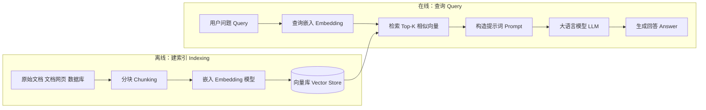
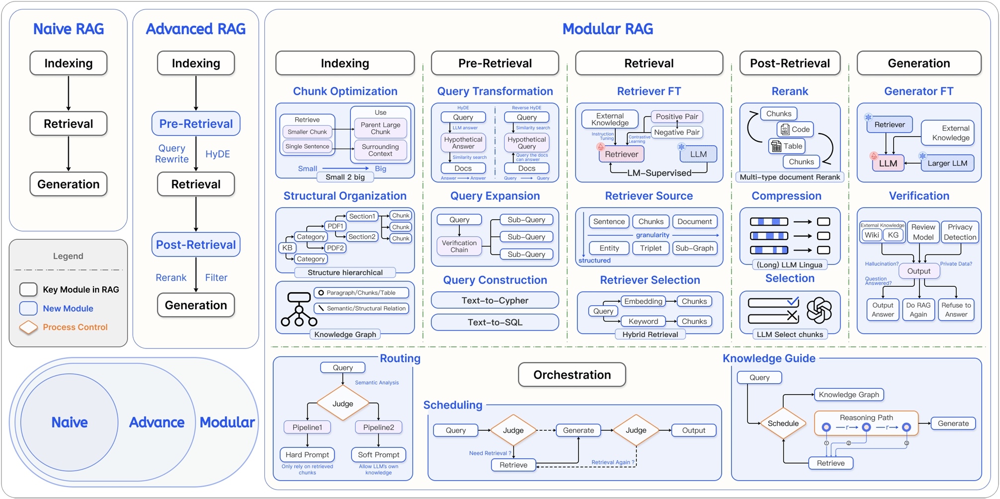
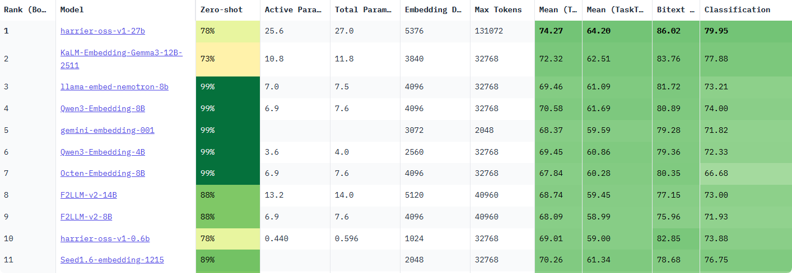

# RAG 实现原理

> 为什么要 RAG（Retrieval‑Augmented Generation）?
> 传统的 AI 大模型完全依赖其内部记忆（训练时学到的知识），这就导致两个问题：
>
> - 知识过时：模型训练完成后，新发生的事情它不知道。
> - 产生幻觉：遇到不懂的问题时，可能会编造一个看似合理但错误的答案。

## 0 引言

### 0.1 核心定义

最基础的 RAG（检索增强生成）原理，可以用一个形象的类比来理解：让 AI 在回答问题时，允许它先“上网搜一下资料”或者“翻一下教科书”，再根据搜到的内容进行回答。

从本质上讲，RAG（Retrieval-Augmented Generation）是一种旨在解决大语言模型（LLM）“知其然不知其所以然”问题的技术范式。它的核心是将模型内部学到的“**参数化知识**”（模型权重中固化的、模糊的“记忆”），与来自外部知识库的“**非参数化知识**”（精准、可随时更新的外部数据）相结合。其运作逻辑就是在 LLM 生成文本前，先通过检索机制从外部知识库中动态获取相关信息，并将这些“参考资料”融入生成过程，从而提升输出的准确性和时效性。

> 💡 一句话总结：RAG 就是让 LLM 学会了“开卷考试”，它既能利用自己学到的知识，也能随时查阅外部资料。

### 0.2 技术原理

简单的概括原理，最基础的 RAG 由以下几部分构成：

- **知识向量化**：先把你的知识切成小段（chunk），算成向量，存入“向量数据库”（这一步叫建索引/ indexing）；
- **语义召回**：当用户提问时，把问题使用相同的模型也进行向量化，并通过相似度检索（Similarity Search），从向量数据库中检索出最相似的几段（retrieval）；
- **上下文整合**：最后把检索到的内容和用户提的问题一起拼成提示词（Prompt），送给大模型生成回答（augmented generation）。

流程图



<div align="center">
   
   <p>图 1-1 RAG 双阶段架构示意图</p>
</div>
### 0.3 技术演进分类

RAG 的技术架构经历了从简单到复杂的演进，如下图所示 大致可分为三个阶段



这三个阶段的具体对比如表 1-1 所示。

<div align="center">
<table border="1" style="margin: 0 auto;">
  <tr>
    <th style="text-align: center;"></th>
    <th style="text-align: center;">初级 RAG（Naive RAG）</th>
    <th style="text-align: center;">高级 RAG（Advanced RAG）</th>
    <th style="text-align: center;">模块化 RAG（Modular RAG）</th>
  </tr>
  <tr>
    <td style="text-align: center;"><strong>流程</strong></td>
    <td style="text-align: center;"><strong>离线:</strong> <code>索引</code><br><strong>在线:</strong> <code>检索 → 生成</code></td>
    <td style="text-align: center;"><strong>离线:</strong> <code>索引</code><br><strong>在线:</strong> <code>...→ 检索前 → ... → 检索后 → ...</code></td>
    <td style="text-align: center;">积木式可编排流程</td>
  </tr>
  <tr>
    <td style="text-align: center;"><strong>特点</strong></td>
    <td style="text-align: center;">基础线性流程</td>
    <td style="text-align: center;">增加<strong>检索前后</strong>的优化步骤</td>
    <td style="text-align: center;">模块化、可组合、可动态调整</td>
  </tr>
  <tr>
    <td style="text-align: center;"><strong>关键技术</strong></td>
    <td style="text-align: center;">基础向量检索</td>
    <td style="text-align: center;"><strong>查询重写（Query Rewrite）</strong><br><strong>结果重排（Rerank）</strong></td>
    <td style="text-align: center;"><strong>动态路由（Routing）</strong><br><strong>查询转换（Query Transformation）</strong><br><strong>多路融合（Fusion）</strong></td>
  </tr>
  <tr>
    <td style="text-align: center;"><strong>局限性</strong></td>
    <td style="text-align: center;">效果不稳定，难以优化</td>
    <td style="text-align: center;">流程相对固定，优化点有限</td>
    <td style="text-align: center;">系统复杂性高</td>
  </tr>
</table>
<p><em>表 1-1 RAG 技术演进分类对比</em></p>
</div>

> 🔔“离线”指提前完成的数据预处理工作（如索引构建）；“在线”指用户发起请求后的实时处理流程。

下面从三个步骤详细讲解 RAG 的实现原理。

> 核心点：索引、检索、生成
>
> 1. 索引：把知识库中的文本分块，算成向量，放进向量库；
> 2. 检索：用户提问时，把问题也变成向量，从向量库中检索出最相似的几段；
> 3. 生成：把检索到的内容和问题一起拼成提示词，送给大模型生成回答。

## 1 离线：建索引 Indexing

> 核心：文档加载、文本分块、向量化、存储

### 1.1 文档加载

RAG 系统中，**数据加载**是整个流水线的第一步，也是不可或缺的一步。

在这一部分会使用到文档加载器：文档加载器负责将各种格式的非结构化文档（如 PDF、Word、Markdown、HTML 等）转换为程序可以处理的结构化数据。数据加载的质量会直接影响后续的索引构建、检索效果和最终的生成质量。

文档加载器在 RAG 的数据管道中一般需要完成三个核心任务：

- 一是解析不同格式的原始文档，将 PDF、Word、Markdown 等内容提取为可处理的纯文本
- 二是在解析过程中同时抽取文档来源、页码、作者等关键信息作为元数据
- 三是把文本和元数据整理成统一的数据结构，方便后续进行切分、向量化和入库，其整体流程与传统数据工程中的抽取、转换、加载相似，目标都是把杂乱的原始文档清洗并对齐为适合检索和建模的标准化语料。

**主流 RAG 文档加载器**

<div align="center">
<table border="1" style="margin: 0 auto;">
  <tr>
    <th style="text-align: center;">工具名称</th>
    <th style="text-align: center;">特点</th>
    <th style="text-align: center;">适用场景</th>
    <th style="text-align: center;">性能表现</th>
  </tr>
  <tr>
    <td style="text-align: center;"><strong>PyMuPDF4LLM</strong></td>
    <td style="text-align: center;">PDF→Markdown转换，OCR+表格识别</td>
    <td style="text-align: center;">科研文献、技术手册</td>
    <td style="text-align: center;">开源免费，GPU加速</td>
  </tr>
  <tr>
    <td style="text-align: center;"><strong>TextLoader</strong></td>
    <td style="text-align: center;">基础文本文件加载</td>
    <td style="text-align: center;">纯文本处理</td>
    <td style="text-align: center;">轻量高效</td>
  </tr>
  <tr>
    <td style="text-align: center;"><strong>DirectoryLoader</strong></td>
    <td style="text-align: center;">批量目录文件处理</td>
    <td style="text-align: center;">混合格式文档库</td>
    <td style="text-align: center;">支持多格式扩展</td>
  </tr>
  <tr>
    <td style="text-align: center;"><strong>Unstructured</strong></td>
    <td style="text-align: center;">多格式文档解析</td>
    <td style="text-align: center;">PDF、Word、HTML等</td>
    <td style="text-align: center;">统一接口，智能解析</td>
  </tr>
  <tr>
    <td style="text-align: center;"><strong>FireCrawlLoader</strong></td>
    <td style="text-align: center;">网页内容抓取</td>
    <td style="text-align: center;">在线文档、新闻</td>
    <td style="text-align: center;">实时内容获取</td>
  </tr>
  <tr>
    <td style="text-align: center;"><strong>LlamaParse</strong></td>
    <td style="text-align: center;">深度PDF结构解析</td>
    <td style="text-align: center;">法律合同、学术论文</td>
    <td style="text-align: center;">解析精度高，商业API</td>
  </tr>
  <tr>
    <td style="text-align: center;"><strong>Docling</strong></td>
    <td style="text-align: center;">模块化企业级解析</td>
    <td style="text-align: center;">企业合同、报告</td>
    <td style="text-align: center;">IBM生态兼容</td>
  </tr>
  <tr>
    <td style="text-align: center;"><strong>Marker</strong></td>
    <td style="text-align: center;">PDF→Markdown，GPU加速</td>
    <td style="text-align: center;">科研文献、书籍</td>
    <td style="text-align: center;">专注PDF转换</td>
  </tr>
  <tr>
    <td style="text-align: center;"><strong>MinerU</strong></td>
    <td style="text-align: center;">多模态集成解析</td>
    <td style="text-align: center;">学术文献、财务报表</td>
    <td style="text-align: center;">集成LayoutLMv3+YOLOv8</td>
  </tr>
</table>
<p><em>表 2-1 当前主流 RAG 文档加载器</em></p>
</div>

[参考链接 - 数据加载](https://datawhalechina.github.io/all-in-rag/#/chapter2/04_data_load)

### 1.2 文本分块 Chunking/Splitting

**理解什么是文档分块**

文本分块（Text Chunking）是构建 RAG 流程的关键步骤。它的原理是将加载后的长篇文档，切分成更小、更易于处理的单元。这些被切分出的文本块，是后续向量检索和模型处理的**基本单位**。


**文本分块的重要性**

1. 满足模型上下文限制

将文本分块的首要原因，是为了适应 RAG 系统中两个核心组件的硬性限制：

- **嵌入模型 (Embedding Model)**: 负责将文本块转换为向量。这类模型有严格的输入长度上限。例如，许多常用的嵌入模型（如 `bge-base-zh-v1.5`）的上下文窗口为 512 个 token。任何超出此限制的文本块在输入时都会被截断，导致信息丢失，生成的向量也无法完整代表原文的语义。因此，文本块的大小**必须**小于等于嵌入模型的上下文窗口。

- **大语言模型 (LLM)**: 负责根据检索到的上下文生成答案。LLM 同样有上下文窗口限制（尽管通常比嵌入模型大得多，从几千到上百万 token 不等）。检索到的所有文本块，连同用户问题和提示词，都必须能被放入这个窗口中。如果单个块过大，可能会导致只能容纳少数几个相关的块，限制了 LLM 回答问题时可参考的信息广度。

2. 为什么“块”不是越大越好

假设嵌入模型最多能处理 8192 个 token，是否应该把块切得尽可能大（比如 8000 个 token）呢？答案是否定的。**块的大小并非越大越好**，过大的块会严重影响 RAG 系统的性能。

分的块太大了会导致以下几个问题：

- 在嵌入过程中会有信息损失
- 生成过程导致“大海捞针”
- 主题稀释导致检索失败

[参考文档 - 文本切分](https://datawhalechina.github.io/all-in-rag/#/chapter2/05_text_chunking)

3. 基础的分块策略

这里先做个简单的介绍，具体的在后面会具体展开，LangChain 提供了丰富且易于使用的文本分割器（Text Splitters），下面将介绍几种最核心的策略。

- 固定大小分块
- 递归字符分块
- 语义分块
- 基于文档结构分块

4. 其他开源架构的分块策略

- Unstructured：基于文档元素的智能分块
- LlamaIndex：面向节点的解析与转换

- ChunkViz：简易的可视化分块工具

### 1.3 向量化（向量嵌入） Embedding

> **什么是 Embedding**
>
> 向量嵌入（Embedding）是一种将真实世界中复杂、高维的数据对象（如文本、图像、音频、视频等）转换为数学上易于处理的、低维、稠密的连续数值向量的技术。
>
> 我们将每一个词、每一段话、每一张图片都放在一个巨大的多维空间里，并给它一个独一无二的坐标。这个坐标就是一个向量，它“嵌入”了原始数据的所有关键信息。这个过程，就是 Embedding。
>
> _Embedding 本质就是把文本 / 图片 / 音频等内容，变成一串固定长度的数字，用来让计算机 “理解” 语义、相似度、特征。_

- **数据对象**：任何信息，如文本“你好世界”，或一张猫的图片。
- **Embedding 模型**：一个深度学习模型，负责接收数据对象并进行转换。
- **输出向量**：一个固定长度的一维数组，例如 `[0.16, 0.29, -0.88, ...]`。这个向量的维度（长度）通常在几百到几千之间。


```python
# 一维浮点数数组（最标准）
[
  0.0234, -0.0567, 0.1234, -0.0987, 0.3456, ...  # 很多很多数字
]
# 二维批量格式（一次性输入多个句子）
[
  [0.023, -0.056, 0.123, ...],  # 句子1的向量
  [0.089, 0.145, -0.032, ...],  # 句子2的向量
  [0.011, -0.222, 0.333, ...]   # 句子3的向量
]
```

**嵌入模型选型指南**

[**MTEB (Massive Text Embedding Benchmark)**](https://huggingface.co/spaces/mteb/leaderboard) 是一个由 Hugging Face 维护的、全面的文本嵌入模型评测基准。它涵盖了分类、聚类、检索、排序等多种任务，并提供了公开的排行榜，为评估和选择嵌入模型提供了重要的参考依据。



下面这张图是网站中的模型评估图像，直观地展示了在选择开源嵌入模型时需要权衡的四个核心维度：

- **横轴 - 模型参数量 (Number of Parameters)** ：代表了模型的大小。通常，参数量越大的模型（越靠右），其潜在能力越强，但对计算资源的要求也越高。
- **纵轴 - 平均任务得分 (Mean Task Score)** ：代表了模型的综合性能。这个分数是模型在分类、聚类、检索等一系列标准 NLP 任务上的平均表现。分数越高（越靠上），说明模型的通用语义理解能力越强。
- **气泡大小 - 嵌入维度 (Embedding Size)** ：代表了模型输出向量的维度。气泡越大，维度越高，理论上能编码更丰富的语义细节，但同时也会占用更多的存储和计算资源。
- **气泡颜色 - 最大处理长度 (Max Tokens)** ：代表了模型能处理的文本长度上限。颜色越深，表示模型能处理的 Token 数量越多，对长文本的适应性越好。

**关键评估维度**

在查看榜单时，除了分数，还需要关注以下几个关键维度：

- **任务 (Task)** ：对于 RAG 应用，需要重点关注模型在 `Retrieval` (检索) 任务下的排名。
- **语言 (Language)** ：模型是否支持你的业务数据所使用的语言？对于中文 RAG，应选择明确支持中文或多语言的模型。
- **模型大小 (Size)** ：模型越大，通常性能越好，但对硬件（显存）的要求也越高，推理速度也越慢。需要根据你的部署环境和性能要求来权衡。
- **维度 (Dimensions)** ：向量维度越高，能编码的信息越丰富，但也会占用更多的存储空间和计算资源。
- **最大 Token 数 (Max Tokens)** ：这决定了模型能处理的文本长度上限。这个参数是你设计文本分块（Chunking）策略时必须考虑的重要依据，块大小不应超过此限制。
- **得分与机构 (Score & Publisher)** ：结合模型的得分排名和其发布机构的声誉进行初步筛选。知名机构发布的模型通常质量更有保障。
- **成本 (Cost)** ：如果是使用 API 服务的模型，需要考虑其调用成本；如果是自部署开源模型，则需要评估其对硬件资源的消耗（如显存、内存）以及带来的运维成本。

**迭代测试与优化**

> 不要只依赖公开榜单做最终决定。

（1）**确定基线 (Baseline)** ：根据上述维度，选择几个符合要求的模型作为你的初始基准模型。

（2）**构建私有评测集** ：根据真实业务数据，手动创建一批高质量的评测样本，每个样本包含一个典型用户问题和它对应的标准答案（或最相关的文档块）。

（3）**迭代优化** ： - 使用基线模型在你的私有评测集上运行，评估其召回的准确率和相关性。 - 如果效果不理想，可以尝试更换模型，或者调整 RAG 流程的其他环节（如文本分块策略）。 - 通过几轮的对比测试和迭代优化，最终选出在你的特定场景下表现最佳的那个“心仪”模型。

### 1.4 存入向量数据库（建索引） Vector Store

> 向量数据库 = 向量存储 + 元数据存储 + 高性能相似索引

向量数据库包含：向量(这是核心)，元数据(必须配套)，索引结构(用户看不到，但决定速度)

- 向量，格式为：`[0.123, -0.456, 0.789, ..., 0.222]`(一堆固定长度的浮点数)，有以下特点：
  - 维度通常为 512-1536 维，具体根据数据类型的要求。
  - 每个值是 32 位或 64 位浮点数
  - 单个数字无意义，整体代表语义 / 特征
- 元数据：如 chunk 的原始文本、来源、创建时间、作者等； \*向量本身无法直接使用，必须绑定数据原始信息

```json
{
    "id": "vec_1001",
    "vector": [0.12, 0.34, ..., 0.56],
    "metadata": {
        "content": "人工智能是...",
        "source": "docs/ai.pdf",
        "create_time": "2025-01-01",
        "user_id": "u123"
    }
}
```

- 索引结构：如 FAISS、Chroma、Qdrant 等。
  向量数据库会自动构建索引，常见：HNSW（最主流，速度快）、IVF（适合海量数据）、PQ 量化（压缩向量，节省内存）
- 向量数据库典型数据结构

```plaintext
[
  {
    "id": 唯一ID,
    "vector": [f32, f32, ... f32],  // 高维向量
    "metadata": { ... }             // 原始文本/图片/业务信息
  },
  ...
]
```

查询时输入一个向量，数据库返回：

- 最相似的 Top-K 向量 ID
- 相似度分数（余弦相似度 / 点积）
- 对应的元数据

**向量数据库的作用**

向量数据库的核心价值在于其**高效处理海量高维向量**的能力。主要功能可以简单概括为以下几点：

高效的相似性搜索、高维数据存储与管理、丰富的查询能力、可扩展与高可用、数据与模型生态集成；

[参考链接-向量数据库-1](https://datawhalechina.github.io/all-in-rag/#/chapter3/08_vector_db)

**主流向量数据库介绍**


当前主流的向量数据库产品包括：

- [ **Pinecone** ](https://www.pinecone.io/)是一款完全托管的向量数据库服务，采用 Serverless 架构设计。它提供存储计算分离、自动扩展和负载均衡等企业级特性，并保证 99.95%的 SLA。Pinecone 支持多种语言 SDK，提供极高可用性和低延迟搜索（<100ms），特别适合企业级生产环境、高并发场景和大规模部署。

- [ **Milvus** ](https://github.com/milvus-io/milvus)是一款开源的分布式向量数据库，采用分布式架构设计，支持 GPU 加速和多种索引算法。它能够处理亿级向量检索，提供高性能 GPU 加速和完善的生态系统。Milvus 特别适合大规模部署、高性能要求的场景，以及需要自定义开发的开源项目。

- [ **Qdrant** ](https://github.com/qdrant/qdrant)是一款高性能的开源向量数据库，采用 Rust 开发，支持二进制量化技术。它提供多种索引策略和向量混合搜索功能，能够实现极高的性能（RPS>4000）和低延迟搜索。Qdrant 特别适合性能敏感应用、高并发场景以及中小规模部署。

- [ **Weaviate** ](https://github.com/weaviate/weaviate)是一款支持 GraphQL 的 AI 集成向量数据库，提供 20+AI 模块和多模态支持。它采用 GraphQL API 设计，支持 RAG 优化，特别适合 AI 开发、多模态处理和快速开发场景。Weaviate 具有活跃的社区支持和易于集成的特点。

- [ **Chroma** ](https://github.com/chroma-core/chroma)是一款轻量级的开源向量数据库，采用本地优先设计，无依赖。它提供零配置安装、本地运行和低资源消耗等特性，特别适合原型开发、教育培训和小规模应用。Chroma 的部署简单，适合快速原型开发。

**选择建议**：

- **新手入门/小型项目**：从 `ChromaDB` 或 `FAISS` 开始是最佳选择。它们与 LangChain/LlamaIndex 紧密集成，几行代码就能运行，且能满足基本的存储和检索需求。
- **生产环境/大规模应用**：当数据量超过百万级，或需要高并发、实时更新、复杂元数据过滤时，应考虑更专业的解决方案，如 `Milvus`、`Weaviate` 或云服务 `Pinecone`。

## 2 在线：查询 Query

> 核心：查询嵌入、检索、生成

### 2.1 查询向量化 Embedding

- 把用户的`question`用同一个嵌入模型(embedding 模型)算成向量`q_vec`=>`(query_vector)`（关键：必须和建索引用的是同一个模型）；

### 2.2 检索 (Retrieval) - Top-K 相似向量

- 在向量库中，计算 `q_vec` 与所有 `chunk` 向量的相似度（常用余弦相似度、内积等）。
- 取"最相似的 K 个"（Top‑K），比如 K 一般取 3 ~ 5。
- 返回这些“最相似”的 chunk 向量，即：[向量 1，向量 2，...，向量 k]

### 2.3 构造提示词 Prompt / (Context Augment)

- 把检索到的内容拼成“上下文”（context）：

```python
prompt = """
    以下是从知识库中检索到的相关内容：\n\n{chunks}\n\n用户问题：{question}\n请基于上述内容回答：。
"""
```

- 目的是让大模型"看着材料回答问题"，而不是只靠自己的记忆。这部分就是 augmented(增强的)。

### 2.4 调用大模型生成回答 (Generation) - 大语言模型

- 把完整的提示词 prompt 交给大语言模型生成回答（GPT、Claude、开源 LLM 等）。
- 模型生成最终文本回答
  - 可以直接返回结果
  - 也可以添加一些后处理，比如去掉无关内容、格式化、润色以及引用来源等。

## 3 总结

从信息流角度看，RAG 在做的是：

- 把“非参数化记忆”（外部文档、向量库）和“参数化记忆”（模型权重）结合：
  - 检索部分：负责从外部知识里找到“相关证据”；
  - 生成部分：负责根据证据 + 问题，组织语言、推理、给出答案。

直觉上，你可以把它当成“开卷考试”：

- 模型是“学生”；
- 向量库是“可检索的教材/资料”；
- RAG 流程就是：先帮你“翻到相关页”，再让你“根据书上内容回答”。

## 4. 伪代码示例

最最基础的 RAG（伪代码，方便理解流程，不是可运行工程）：

```python
# ===== 离线：索引 =====
documents = load_documents(...)                     # 1. 读文档
chunks = split_into_chunks(documents, size=1000)     # 2. 分块
embeddings = embed_model(chunks)                     # 3. 向量化
vector_store.save(chunks, embeddings)                # 4. 存入向量库

# ===== 在线：查询 =====
def rag_answer(question):
    q_vec = embed_model(question)                    # 1. 查询向量化
    top_chunks = vector_store.search(q_vec, k=3)     # 2. 检索 top-k

    context = "\n".join(top_chunks)                  # 3. 构造上下文
    prompt = f"""
        你是一个 QA 助手。
        以下是从知识库检索到的内容：
        {context}

        用户问题：{question}
        请只基于上述内容回答。
    """

    answer = llm.generate(prompt)                    # 4. 大模型生成
    return answer

```
